# **Criminal Analyzer**

 

## **Introducción a la problematica**

México es un país que tiene altos indices de criminalidad al año, desde asesinatos,
extorsiones, asaltos, corrupción y muchas cosas más (no es de extrañar que varias de las
ciudades más violentas del mundo estén en México). Muchos de estos crímenes quedan
impunes y otros simplemente no son tomados en cuenta. ¿Causas? Posiblemente la
incompetencia de nuestras autoridades, la indiferencia obtenida por la alta tasa de
criminalidad día con día, tal vez debido a nuestra cultura (?), falta de oportunidades o
educación deficiente. Como sea esto se le tiene dar posibles soluciones a la problemática, no
sera una tarea sencilla pero cada pequeña aportación es de gran utilidad.
He aquí donde entra “Criminal Analyzer” (sí, el nombre esta en inglés para que suene más
profesional), el cual es un software que permite agilizar la identificación de criminales en
base a datos recuperados cerca de la escena del crimen, algunos ejemplo son datos
recuperados en base a descripciones de testigos, cámaras de seguridad cercanas, evidencia
encontrada en la escena del crimen, etc. Una vez recopilada la información esta sera
ingresada al software, posteriormente iniciara la consulta para verificar si las características
de uno de los sospechosos detenidos concuerdan con los recopilados e ingresados al
sistema, en caso de ser afirmativo el sistema notificara de que es el responsable del crimen,
en caso contrario no se le podrá culpar del crimen.
En el siguiente apartado se explica mejor la dinámica del software, ademas se ilustra con una
pequeña infografía. 

 
 

## **Dinámica del proyecto**

La dinamia del proyecto es sencilla, antes de interactuar con el sistema se deberá de contar
con los datos recopilados del crimen cometido, estos datos pueden ser recopilados de
diversas formas, como por ejemplo descripciones de testigos, cámaras de seguridad
cercanas, indicios en la escena del crimen, etc. Los datos serán introducidos por medio de
una interfaz en consola, posteriormente se podrá iniciar con la consulta de datos para
determinar si las características del sospechoso introducidas al sistema concuerdan con las
características en la base de conocimiento, en caso de ser cierto el sistema alertara de que
se trata del responsable del crimen, en caso contrario no se podrá culpar de dicho crimen.
Esta dinámica se explica mejor con una infografía, a continuación se muestra el flujo del
sistema desde la escena del crimen hasta la obtención de los resultados por parte del
sistema

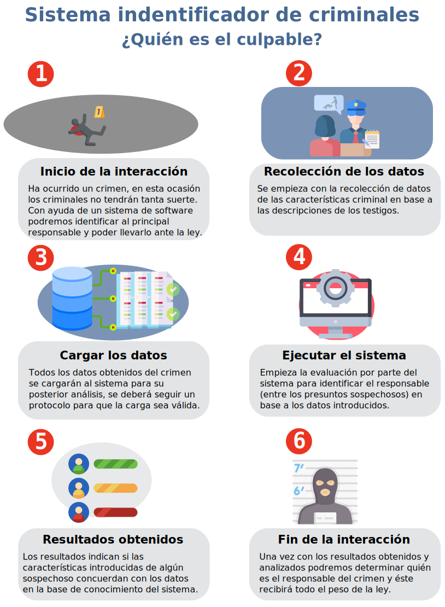

> Infografía de la dinámica del sistema.

 

También se adjunta el diagrama de flujo del sistema para tener una idea más concreta del flujo de entrada y salida del sistema. 

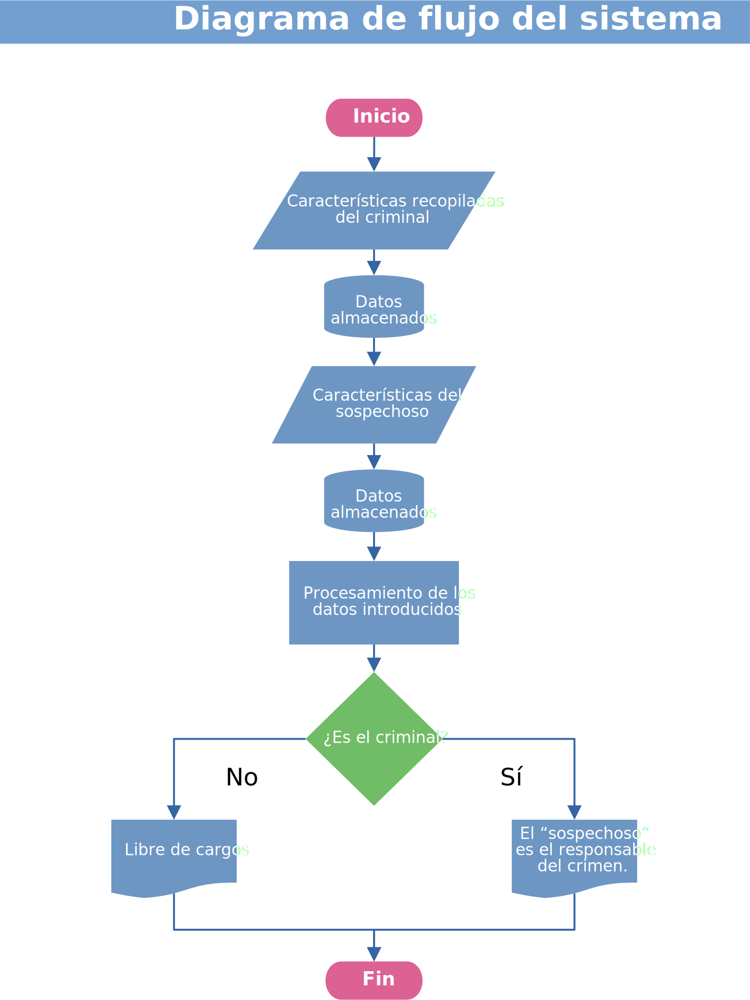

> Diagrama de flujo del sistema.

 
 

## **Lo que es y no es este proyecto**
Posiblemente no quede del todo claro algunos aspectos del proyecto, como por ejemplo el
objetivo de este, sus alcances, limitaciones y que es lo que se plantea resolver, es por eso
que he decidido agregar esta sección explicando con más detalle los puntos anteriores. Para
esto he decidido englobar en dos partes, la primera “Que no es este proyecto” habla sobre
algunas confusiones o ideas erróneas que piensa las personas sobre el proyecto, la segunda
parte es “Que es este proyecto” donde se especifica de manera explicita la razón de ser de
este proyecto.

### **Que No es este proyecto:**
* No es un sistema impulsado por inteligencia artificial que permite determinar con exactitud quien es el criminal en base a características ingresadas.

* No es un sistema conectado con una base datos policial que permita determinar quien es un criminal en base a antecedentes penales.

### **Que Sí es este proyecto:**
* Es un sistema que recibe una entrada de características recopiladas anteriormente, genera una base de conocimiento, se hace una consulta comparando los valores de dicha consulta con la base de conocimiento y genera una salida en base a los resultados.

* El objetivo principal del proyecto es simplemente agilizar las comparaciones de características recopiladas del supuesto criminal con las características de los sospechosos detenidos, de esta manera obtenemos resultados más rápidos y acertados sobre quien es el presunto autor de dicho crimen. 

 
 

## **Recorrido por el sistema**

Haremos un ligero recorrido por el sistema explicando ligeramente cada apartado del mismo,
de esta manera obteniendo una mejor idea de lo que trata este proyecto.
El sistema cuenta con 3 apartados, el primero es el inicio del sistema, el segundo apartado
es la entrada de datos para la base de conocimientos, por ultimo el tercer apartado es para
realizar consultas. 

 

 ### **Pantalla de inicio**

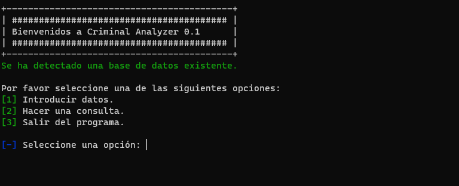

> Captura de pantalla del inicio del sistema.

Este es el primer apartado que varemos cuando se inicie el programa, nos da un bienvenida al sistema y nos muestra 3 opciones que podemos seleccionar. 

**[1] Introducir datos:** Esta opción nos llevara al apartado donde podremos ingresar los datos recopilados de la escena del crimen, cuando no hay una base de datos creada previamente esta opción es la que se tiene que seleccionar primero para poder realizar una consulta. 

**[2] Hacer una consulta:** Nos lleva a la sección donde podremos introducir los datos a consultar y obtener una respuesta en base a estos.

**[3] Salir del programa:** Como lo indica la opción, al seccionar esta nos sacara complementarte del sistema sin mas. 

 

 ### **Pantalla de captura de datos**

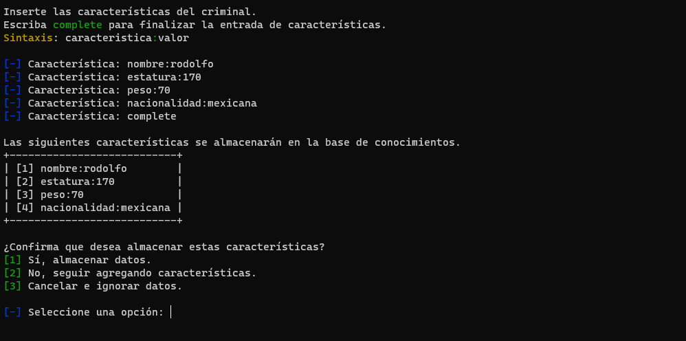

> Captura de pantalla donde se capturan los datos.

En el segundo apartado tenemos la captura de datos para la creación de la base de conocimiento. Tiene que haber una base de conocimientos existente para poder realizar consultas, dado a esto el primer apartado que visitaremos al iniciar el programa (después del inicio por supuesto) sera este.

Nos da una ligera explicación sobre la forma de ingresar los datos y la palabra clave para poder finalizar la captura de información.
La sintaxis para la ingresar los datos es la siguiente: 

**<text style="color:#41A0D6">característica</text> : <text style="color:#41D67C">valor**</text>

Donde “característica” es la característica que se va almacenar y “valor” representa el valor que le acompaña, por ejemplo, si queremos almacenar la estatura de una persona cuyo valor es de 170 cm lo haríamos de la siguiente manera: estatura:170  

Cuando se escribe la palabra “complete” el programa deja de esperar entrada de datos, muestra todos los valores capturados y pregunta al usuario que es lo que desea hacer a continuación.

**[1] Sí, Almacenar datos:** Seleccionar esta opción en caso de estar seguro de que desea almacenar los datos en la base de conocimiento.

**[2] No, seguir agregando características:** Esta opción nos da la posibilidad de poder seguir agregando más características.

**[3] Cancelar e ignorar datos:** Ignora todos los datos ingresados y regresa al inicio.

 

### **Pantalla de consultas**

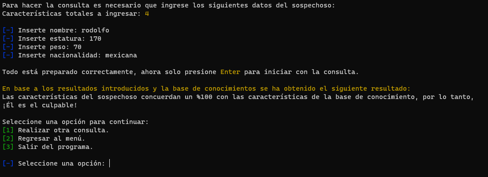

> Captura de pantalla donde se hace la consulta de datos.

El tercer apartado nos muestra una interfaz para iniciar con las consultas de las características de un sospechoso, en base a lo capturado en la base de conocimiento (ver apartado anterior) serán las características solicitadas por el sistema. 

Una vez ingresadas dichas características el sistema iniciara con la evaluación de dichos datos, en caso de que el sospechoso cumpla con todas las características el sistema arrojara un mensaje indicando de que se trata del sospechoso, en caso contrario arrojara un mensaje indicando de que no se trata del responsable de dicho crimen. Esta evaluación de características y los mensajes desplegados son realizados por el motor de ejecución de Prolog.

Finalizada la consulta nos aparece las siguientes opciones para poder seguir con el flujo del sistema:

**[1] Realizar otra consulta:** Al seleccionar esta opción el sistema vuelve a cargar este mismo apartado para poder realizar otra consulta. 

**[2] Regresar al menú:** Esta opción nos regresa al inicio del programa.

**[3] Salir del programa:** Esta opción finaliza el programa definitivamente.

 
 

## **Descripción técnica, requisitos y código.**
El proyecto esta desarrollado usando dos lenguajes de programación, por un lado tenemos
**Python** que fue utilizado para desarrollar la interfaz de entrada y salida de los datos, por otra
parte tenemos a **Prolog** que fue utilizado como motor de resolución de consultas del sistema.
Se opto por Python debido a su excelente integración con el sistema, en el caso de Prolog su
uso es obligatorio. No existe una conexión directa entre Python y Prolog en el sistema,
básicamente se esta utilizando la terminal del sistema como “puente” entre estos dos
lenguajes, Python unicamente captura los datos del usuario y posteriormente genera un
archivo con dichos datos, el archivo generado sera la base de datos

Los requisitos del proyecto son los siguientes:
* Tener Python 3.0+ instalado en el sistema.
* Tener PIP (el sistema de gestión de paquetes de Python) instalado en el sistema.
* Tener SWI-Prolog instalado en el sistema.
* Acceso a Internet, con la finalidad de resolver la dependencias de bibliotecas del
sistema.

**Importante:** Es necesario (obligatorio) que estos programas se encuentren registrados en
las variables de entorno del sistema, osea, que puedan ser accedidos desde la terminal con
tan solo escribir el nombre de dicho programa, en caso contrario se tendrán que registrar
para que el sistema pueda funcionar correctamente.

 

 

### **Capturas de pantalla de código Prolog generado** 

 

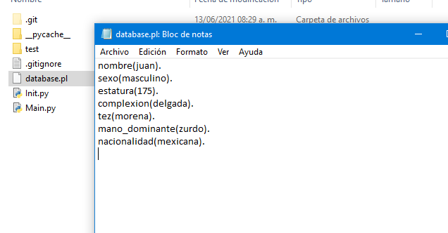

> Captura de pantalla de la base de conocimiento generada en base a los datos introducidos.

 

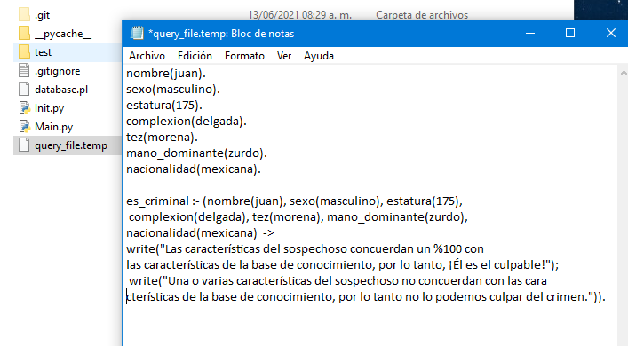

> Captura de pantalla donde se muestra un archivo temporal de consulta para Prolog.

 
 

## **Ejemplo de uso**

Para entender un poco mejor el funcionamiento del sistema vamos a imaginar que sucede una situación muy hipotética como se muestra a continuación, cabe aclarar que este ejemplo es muy sencillo con fines demostrativos, una situación “real” con llevaría mucha más información involucrada. 

 

Imaginemos la siguiente situación: 

Ha ocurrido un asesinato en Tijuana (que novedad), al parecer el crimen fue efectuado con un arma de fuego. Nuestro equipo de investigadores se dirigió hasta la escena del crimen y logro recopilar distintos datos que nos pueden conducir con el responsable de dicho asesinato. Los datos fueron recopilados de distintas fuentes, algunos fueron en base a descripciones por parte de testigos, se logro acceder a una cámara cercana a la escena del rimen y ademas se encontraron indicios en dicha escena.

Los investigadores obtuvieron los siguientes datos:

 

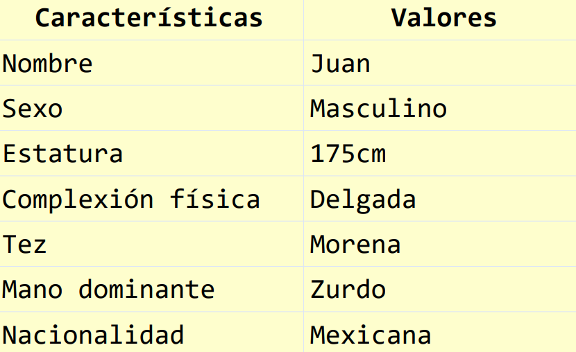

> Recopilación de datos hipotéticos.

 

Una vez recogidos los datos se prosigue a ingresarlos al sistema como se muestra a continuación: 

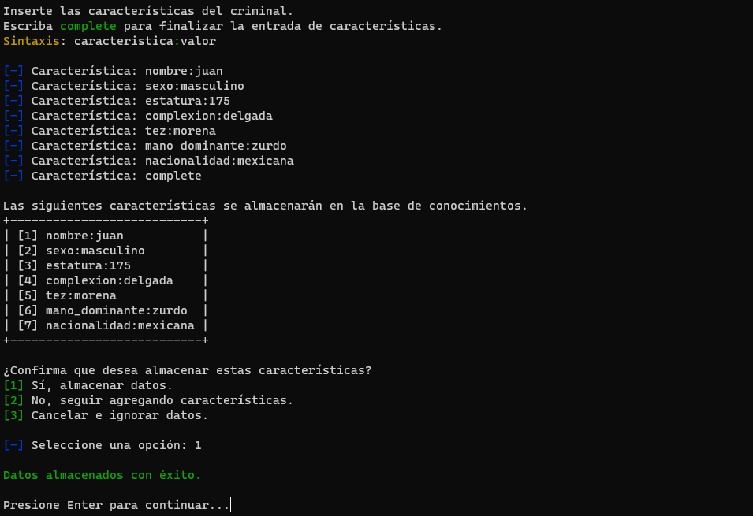

> Captura de pantalla donde se muestra la captura de los datos obtenidos anteriormente.

 

Se prosigue con un operativo donde se detuvieron a dos sospechosos, estos sospechosos fueron trasladados al departamento de investigación policial para ser analizados y determinar quien es el responsable de dicho crimen. En base a las características de los sospechosos se obtuvieron los siguientes resultados:

 

### **Sospechoso #1**

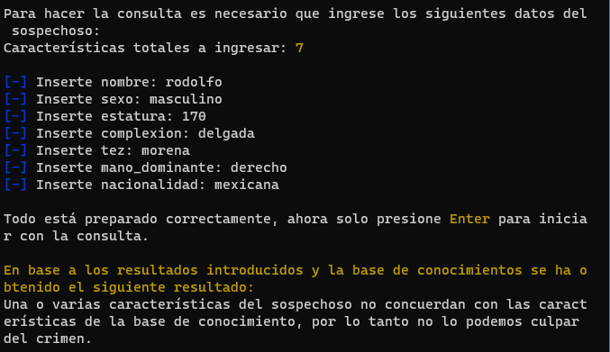

> Consulta de datos en base a los datos del sospechoso #1.

 

### **Sospechoso #2**

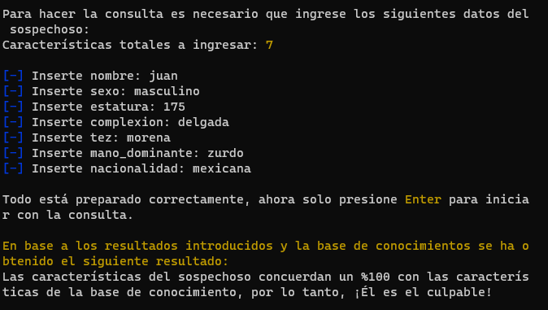

> Consulta de datos en base a los datos del sospechoso #2.

 

**Conclusión del caso:** Se ha resuelto satisfactoriamente, ahora el criminal pagara por sus actos. 

Pareciera que no tiene mucha utilidad este sistema, pero ahora imagina una situación donde se tienen decenas de características recopiladas y varios sospechosos detenidos ¡Aquí es donde la cosa cambia!  La idea de este sistema es agilizar las consultas recopiladas desde el inicio, de esta manera las comparaciones no se estarían haciendo de manera manual y ademas el margen de error estaría disminuyendo en dichas comparaciones. 
